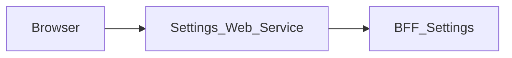

# Settings_Web_Service — Technical documentation

[Module overview](module.md) · [Français](../fr/technical.md) · [README](../../README.md)

## Architecture and request handling

Next.js 15.5.25, React 19 and TypeScript application using the App Router. The browser calls same-origin routes; the Next.js server forwards data to **BFF_Settings**.



The page keeps the editable profile and bootstrap data in React state. `save` submits `/settings/profile`, then replaces the form with the saved response. Other tabs display their available or unavailable state without simulating a save.

The generic proxy reads the versioned OpenAPI contract to allow paths and methods. It preserves query parameters, binary bodies, statuses and useful headers, filters transport headers, disables caching and does not automatically follow redirects. Its timeout is 15 seconds.

## Data and persistence

The following sources and limitations describe the associated BFF, which determines persistence for the displayed data.

The profile comes from Core `/api/v1/user/me/`; sessions come from `/api/v1/sessions/`. Fields are `first_name`, `last_name`, `email` and `phone`. The session schema retains displayable information and removes internal fields. The BFF stores no preferences locally.

Notifications, appearance and general remain unavailable. System hosts local assistance only. Security displays sessions without managing other settings. The preference paths currently have empty request/response schemas and bootstrap provides no preference values; route existence alone does not establish a usable contract.

### Local assistance (MAIR-304)

`src/components/settings-assistance.tsx` handles user-triggered exports without an effect, timer loop, network call or persistence. `src/lib/local-assistance.ts` validates authored text (nonblank, at most 5,000 characters), builds plain-text/JSON files and requests a Blob download. An appended temporary anchor is removed immediately; its object URL is revoked after one second on success or immediately on failure. The UI reports a download request, not a confirmed saved file or delivered support message. Raw exceptions never reach the assistance UI or exported diagnostic.

Only coarse browser/OS labels are derived from `navigator.userAgent` when the diagnostic button is clicked. The raw string is never exported; unknown families remain unidentified. The JSON allowlist is `module`, `generatedAt`, `browser`, `operatingSystem`, `capabilities.objectUrls`. No business DTO is passed to the component, no storage is read/cleared and no deployment version/date or quota is invented. No new environment, package, route, permission or BFF operation is required.

Node tests cover export validation/content/privacy and download cleanup; component tests exercise the real page, keyboard access, axe checks, errors/retry and the absence of additional bootstrap calls. The contract harness also verifies the System tab adds no upstream operation.

React state manages display and pending operations. This repository defines no business database of its own; save guarantees come from the BFF and its sources described above.

## Installation and local startup

Use Node.js 22 to reproduce the contract job and npm with the committed lockfile. Other job and Docker versions are detailed below.

Private `@mairie360/*` dependencies require GitHub Packages access. Set `NODE_AUTH_TOKEN` in the environment to a token allowed to read these packages, as configured in `.npmrc`. Do not commit its value.

```bash
npm ci
```

Create `.env.local` in the repository root. Example for the BFF running on the same machine:

```dotenv
SETTINGS_BFF_URL=http://localhost:4008
```

Start BFF_Settings, the only BFF this front calls, then start the web service. Port `5008` below is an explicit local choice to avoid collisions; it is not a claim about ports in every Compose file.

```bash
npm run dev -- --port 5008
```

Open `http://localhost:5008`. To run the build with the Next.js script:

```bash
npm run build
npm run start -- --port 5008
```

## Configuration

Values below are local examples or explicitly described behavior, not production credentials.

| Variable or precedence | Explicit local example | Purpose |
| --- | --- | --- |
| `SETTINGS_BFF_URL` → `BFF_SETTINGS_BASE_URL` | http://localhost:4008 | Left-to-right proxy precedence; configure an HTTP(S) URL explicitly. Missing or invalid configuration returns an uncached 503 without contacting an upstream. |

Inside a container, `localhost` refers to that container. Use the BFF service DNS name on the Docker network or a reachable host address. Compose files sometimes include other services and legacy settings; check effective URLs and ports before using them.

## Routes and data contract

Inventory extracted from `contracts/openapi.json`. Replace brace parameters with real identifiers. Detailed types, required fields, responses and any examples are defined in that contract; table statuses are the declared statuses, not an exhaustive list of transport or validation errors.

These data paths are exposed at the same origin through the proxy; Next.js pages are separate. `/openapi.json` and `/swagger.json` are also forwarded. Open the `/docs` Swagger UI directly on the BFF.

| Method | Path | Declared body | Declared statuses |
| --- | --- | --- | --- |
| GET | `/health` | — | 200 |
| GET | `/check_apis` | — | 200, 502 |
| GET | `/settings/bootstrap` | — | 200, 401, 502 |
| PATCH | `/settings/profile` | application/json | 200, 400 |
| PATCH | `/settings/notifications` | application/json | 200, 404 |
| PATCH | `/settings/appearance` | application/json | 200, 404 |
| PATCH | `/settings/general` | application/json | 200, 404 |

### Pages

| Page | Source |
| --- | --- |
| `/` | [src/app/page.tsx](../../src/app/page.tsx) |

The front has no local API route: its only server route is the contract proxy ([src/app/[...path]/route.ts](../../src/app/%5B...path%5D/route.ts)). A front calls a single BFF, so session paths such as `/api/user/me` or `/api/auth/*` are not served here (404).

## Session, permissions and errors

The session comes only from the `accessToken` cookie set by Login_Web_Service. The generic proxy uses an explicit Bearer header or, when absent, the `accessToken` cookie. Business permissions remain those of the BFF and its sources.

The generic proxy returns 400 for an invalid path, 404 for a path outside the contract, 405 for a disallowed method and 502 when the service is unreachable or times out. Upstream responses are preserved, including empty 204/205/304 bodies.

Every response carries `X-Frame-Options: DENY`, `X-Content-Type-Options: nosniff`, `Referrer-Policy`, `Permissions-Policy` and `Cross-Origin-Resource-Policy`, `Cross-Origin-Embedder-Policy` and `Cross-Origin-Opener-Policy` (`next.config.ts`), and `X-Powered-By` is disabled. [src/middleware.ts](../../src/middleware.ts) adds a `Content-Security-Policy` with a per-request nonce to every page (it does not redirect unauthenticated users), which Next.js applies to its scripts. Pages are therefore rendered on demand (`dynamic = "force-dynamic"` in the layout). Stylesheets are limited to the origin and the nonce; only `style` attributes rendered by shared components are allowed through `style-src-attr 'unsafe-inline'`, and `next dev` also allows `'unsafe-eval'`. Any new external resource (image, font, API called from the browser) must be added to the policy in `src/lib/content-security-policy.ts`.

## Synchronization and verification

The front uses a single contract: the one **BFF_Settings publishes** in the `@mairie360/bff-settings-openapi` package, pinned to an exact `X.Y.Z` version in `package.json`. It is never copied from a BFF checkout, which can be ahead of the last release. After a new BFF_Settings release, run in this repository:

```bash
npm install --save-exact @mairie360/bff-settings-openapi@X.Y.Z
npm run contracts:sync
npm run contracts:check
npm run test:contracts
npm run lint
npm run build
```

The package only contains orval output (TypeScript models and endpoints). `contracts:sync` (alias `contracts:generate`) rebuilds `contracts/openapi.json` from the installed package with `scripts/orval-contract.mjs`; the proxy reads that file and the code imports its types from `@mairie360/bff-settings-openapi/model`. `contracts:check` fails if the version is not exact, if the installed package differs from `package.json`, if a second `bff-*-openapi` package exists or if `contracts/openapi.json` is stale. These commands run offline. After a bump, also move the `bff-settings` image tag of the test stacks to the same version. `test:contracts` runs the Node tests without coverage; `npm test` runs them with a 60% threshold (lines, branches, functions) over every `src/**/*.ts` module.

The tests check that the front only reaches the network through the contracts. `tests/network-contract.test.cjs` scans the TypeScript AST of `src/`: only `src/lib/bff-client.ts` and `src/lib/bff-proxy.ts` call `fetch`, every `requestBff` call (all in `src/lib/settings-api.ts`) targets a literal operation of `contracts/openapi.json`, and the only server relay is the proxy to `configuredBffUrl()` (the only BFF URL read from the environment is `SETTINGS_BFF_URL` → `BFF_SETTINGS_BASE_URL`), so the front calls a single BFF. `tests/settings.bff-mocks.test.cjs` runs the whole chain (browser code → Next.js routes → real HTTP client) against a real HTTP server that simulates BFF_Settings from `contracts/openapi.json`. The mock rejects any route, method or body outside the contract, and the harness rejects any browser call to another origin and any server call to a host other than BFF_Settings. `tests/package-contract.test.cjs` checks the exact pin, that no other contract package exists, that `contracts/openapi.json` is exactly the package rebuild and that the test stacks start `bff-settings` at the package version. orval only types success responses (and the preference 404s), so simulated error replies are marked outside the contract.

For documentation-only changes, check links, accuracy in both languages and `git diff --check`; do not regenerate contracts without bumping the package.

## CI/CD and Docker execution

The `contracts.yml` job uses Node.js 22, `actions/checkout@v7` and `actions/setup-node@v7`. It runs on pushes, pull requests and manual dispatch; it installs with `npm ci`, checks contracts and runs the associated tests.

`cicd.yml` calls `mairie360/CICD/.github/workflows/frontend-cicd.yml@v2.0.0`, with `cicd_version: v2.0.0` and `node_version: "23"`. Reusable steps and GitHub environments determine actual checks, publications and deployments.

The Dockerfile defaults to `NODE_VERSION=23.1.0` and the Next.js `standalone` build; the image command is `["node", "server.js"]`. Image ports and Compose mappings can differ from the local port suggested above.

Before running Docker, check service variables, build secrets and networks in the repository files. Green CI validates its jobs; it does not prove business-service availability in a remote environment.

## Troubleshooting

Associated BFF diagnostics: If the profile loads but sessions do not, check `sources.sessions` and the Core `/api/v1/sessions/` response. PATCH 400 can result from an unknown field or an empty body. An unavailable panel should not be interpreted as a failed save.

For a proxy error, compare the path and method with the inventory, then check the BFF URL and session. For a 401 after navigating between modules, check the `accessToken` cookie and its domain. A 404 for a requirement described in `BACKEND.md` may refer to a feature that is only proposed.

## Repository reference

- [src/app/page.tsx](../../src/app/page.tsx)
- [src/lib/bff-client.ts](../../src/lib/bff-client.ts)
- [src/lib/bff-proxy.ts](../../src/lib/bff-proxy.ts)
- [src/app/[...path]/route.ts](../../src/app/%5B...path%5D/route.ts)
- [src/lib/settings-api.ts](../../src/lib/settings-api.ts)
- [contracts/openapi.json](../../contracts/openapi.json)
- [scripts/orval-contract.mjs](../../scripts/orval-contract.mjs)
- [scripts/contracts.mjs](../../scripts/contracts.mjs)
- [package.json](../../package.json)
- [.github/workflows/contracts.yml](../../.github/workflows/contracts.yml)
- [.github/workflows/cicd.yml](../../.github/workflows/cicd.yml)
- [Dockerfile](../../Dockerfile)
- [docker-compose.yml](../../docker-compose.yml)

Historical supplements: [BFF.md](../../BFF.md), [BACKEND.md](../../BACKEND.md). Proposed requirements must remain distinct from implemented behavior.
