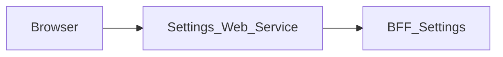

# Settings_Web_Service — Documentation technique

[Présentation du module](module.md) · [English](../en/technical.md) · [README](../../README.md)

## Architecture et traitement des requêtes

Application Next.js 15.5.25, React 19 et TypeScript avec App Router. Le navigateur appelle les routes de la même origine; le serveur Next.js relaie les données vers **BFF_Settings**.



La page conserve le profil éditable et les données du bootstrap dans l’état React. `save` transmet `/settings/profile`, puis remplace le formulaire avec la réponse sauvegardée. Les autres onglets affichent leur état disponible ou indisponible sans simuler de sauvegarde.

Le proxy générique lit le contrat OpenAPI versionné pour autoriser chemins et méthodes. Il conserve paramètres de requête, corps binaire, statuts et en-têtes utiles, filtre les en-têtes de transport, désactive le cache et n’effectue pas de suivi automatique des redirections. Son délai est de 15 secondes.

## Données et persistance

Les sources et limites suivantes concernent le BFF associé, dont dépend la sauvegarde des données affichées.

Le profil vient de Core `/api/v1/user/me/`; les sessions viennent de `/api/v1/sessions/`. Les champs sont `first_name`, `last_name`, `email` et `phone`. Le schéma des sessions ne conserve que les informations affichables et retire les champs internes. Aucune préférence n’est stockée localement par le BFF.

Les panneaux notifications, apparence, général et système du web service indiquent actuellement leur indisponibilité. La sécurité affiche les sessions, sans gérer les autres réglages. Les adaptateurs de préférences ne garantissent pas que les routes correspondantes soient déployées dans Core.

L’état React gère l’affichage et les opérations en cours. Ce dépôt ne définit pas de base métier propre; les garanties de sauvegarde sont celles du BFF et de ses sources décrites ci-dessus.

## Installation et lancement local

Utiliser Node.js 22 pour reproduire le job de contrats et npm avec le fichier de verrouillage versionné. Les versions des autres jobs et de Docker sont précisées plus bas.

Les dépendances privées `@mairie360/*` nécessitent un accès GitHub Packages. Configurer `NODE_AUTH_TOKEN` dans l’environnement avec un jeton autorisé à lire ces packages, conformément à `.npmrc`. Ne pas enregistrer la valeur dans Git.

```bash
npm ci
```

Créer `.env.local` à la racine. Exemple pour des BFF exécutés sur la même machine:

```dotenv
SETTINGS_BFF_URL=http://localhost:4008
USER_BFF_URL=http://localhost:4000
```

Démarrer le BFF associé et BFF User pour les parcours de session, puis lancer le web service. Le port `5008` ci-dessous est un choix local explicite pour éviter les collisions; ce n’est pas une affirmation sur les ports de tous les fichiers Compose.

```bash
npm run dev -- --port 5008
```

Ouvrir `http://localhost:5008`. Pour exécuter le build avec le script Next.js:

```bash
npm run build
npm run start -- --port 5008
```

## Configuration

Les valeurs ci-dessous sont des exemples locaux ou des comportements explicitement indiqués, pas des identifiants de production.

| Variable ou priorité | Exemple / repli indiqué | Rôle |
| --- | --- | --- |
| `SETTINGS_BFF_URL` → `BFF_SETTINGS_BASE_URL` | http://localhost:4008 | Priorité de gauche à droite dans le proxy; l’URL indiquée est le repli local. |
| `USER_BFF_URL` → `BFF_USER_API_URL` | http://localhost:4000 | Priorité propre aux adaptateurs de session vers BFF User. |
| `BFF_CONTRACT_DIR` | ../BFF_Settings/contracts | Répertoire des contrats BFF pour les scripts de synchronisation et de contrôle. |

Dans un conteneur, `localhost` désigne le conteneur lui-même. Utiliser le nom DNS du service BFF sur le réseau Docker, ou une adresse d’hôte accessible. Les fichiers Compose incluent parfois d’autres services et des paramètres hérités; vérifier les URL et ports effectifs avant de les employer.

## Routes et contrat de données

Inventaire extrait de `contracts/openapi.json`. Les paramètres entre accolades sont remplacés par des identifiants réels. Les types détaillés, champs requis, réponses et exemples éventuels sont définis dans ce contrat; les statuts du tableau sont ceux déclarés, sans prétendre lister toutes les erreurs de transport ou de validation.

Ces chemins de données sont exposés à la même origine par le proxy; les pages Next.js sont distinctes. `/openapi.json` et `/swagger.json` sont également relayés. L’interface Swagger `/docs` se consulte directement sur le BFF.

| Méthode | Chemin | Corps déclaré | Statuts déclarés |
| --- | --- | --- | --- |
| GET | `/health` | — | 200 |
| GET | `/check_apis` | — | 200, 502 |
| GET | `/settings/bootstrap` | — | 200, 401, 502 |
| PATCH | `/settings/profile` | application/json | 200, 400 |
| PATCH | `/settings/notifications` | application/json | 200, 404 |
| PATCH | `/settings/appearance` | application/json | 200, 404 |
| PATCH | `/settings/general` | application/json | 200, 404 |

### Pages et adaptateurs locaux

| Page | Source |
| --- | --- |
| `/` | [src/app/page.tsx](../../src/app/page.tsx) |

| Méthode | Route locale | Source |
| --- | --- | --- |
| GET | `/api/user/me` | [src/app/api/user/me/route.ts](../../src/app/api/user/me/route.ts) |
| POST | `/api/auth/logout` | [src/app/api/auth/logout/route.ts](../../src/app/api/auth/logout/route.ts) |
| GET | `/api/auth/me` | [src/app/api/auth/me/route.ts](../../src/app/api/auth/me/route.ts) |
| GET | `/api/auth/session` | [src/app/api/auth/session/route.ts](../../src/app/api/auth/session/route.ts) |

## Session, permissions et erreurs

Les adaptateurs `/api/auth/me`, `/api/auth/session` et `/api/user/me` utilisent BFF User pour la session; `/api/auth/logout` relaie la déconnexion. Le proxy générique utilise le Bearer explicite ou, en son absence, le cookie `accessToken`. Les permissions métier restent celles du BFF et de ses sources.

Le proxy générique répond 400 pour un chemin invalide, 404 pour un chemin hors contrat, 405 pour une méthode interdite et 502 si le service est injoignable ou dépasse le délai. Les réponses amont sont conservées, y compris les corps vides 204/205/304.

## Synchronisation et vérifications

Après une modification de routes ou de schémas, exporter le contrat dans **BFF_Settings** avec `npm run contracts:generate`, puis exécuter dans ce dépôt:

```bash
npm run contracts:sync
npm run contracts:check
npm run test:contracts
npm run lint
npm run build
```

`contracts:sync` copie le contrat BFF et régénère `src/contracts/bff.d.ts`. `contracts:check` compare aussi le BFF voisin lorsqu’il est présent; dans un checkout isolé, il vérifie les types contre la copie locale versionnée. `test:contracts` exécute les tests Node du proxy.

Le générateur de types est fixé à `openapi-typescript@7.10.1` dans `scripts/contracts.mjs` et s’exécute via npm. Pour une modification uniquement documentaire, vérifier les liens, l’exactitude des deux langues et `git diff --check`; ne pas régénérer les contrats sans modification de leur source.

## CI/CD et exécution Docker

Le job `contracts.yml` utilise Node.js 22, `actions/checkout@v7` et `actions/setup-node@v7`. Il s’exécute sur push, pull request et lancement manuel; il installe avec `npm ci`, contrôle les contrats et lance les tests dédiés.

`cicd.yml` appelle `mairie360/CICD/.github/workflows/frontend-cicd.yml@v2.0.0`, avec `cicd_version: v2.0.0` et `node_version: "23"`. Les étapes réutilisables et les environnements GitHub déterminent les contrôles, publications et déploiements effectifs.

Le Dockerfile utilise par défaut `NODE_VERSION=23.1.0` et le build Next.js `standalone`; la commande de l’image est `["node", "server.js"]`. Le port de l’image et les mappings Compose peuvent différer du port local proposé plus haut.

Avant un lancement Docker, vérifier les variables de service, les secrets de build et les réseaux dans les fichiers du dépôt. Une CI verte valide ses jobs; elle ne prouve pas la disponibilité des services métier dans un environnement distant.

## Diagnostic

Diagnostic du BFF associé: Si le profil charge mais pas les sessions, vérifier `sources.sessions` et la réponse Core `/api/v1/sessions/`. Un PATCH 400 peut venir d’un champ inconnu ou d’un corps vide. Un panneau indisponible ne doit pas être interprété comme une sauvegarde échouée.

En cas d’erreur de proxy, comparer la route et la méthode à l’inventaire, vérifier l’URL du BFF puis la session. Pour un 401 après navigation entre modules, vérifier le cookie `accessToken`, son domaine et le service BFF User. Un 404 sur un besoin décrit dans `BACKEND.md` peut correspondre à une fonctionnalité seulement proposée.

## Repères dans le dépôt

- [src/app/page.tsx](../../src/app/page.tsx)
- [src/lib/bff-client.ts](../../src/lib/bff-client.ts)
- [src/lib/bff-proxy.ts](../../src/lib/bff-proxy.ts)
- [src/app/[...path]/route.ts](../../src/app/%5B...path%5D/route.ts)
- [src/lib/user-bff-proxy.ts](../../src/lib/user-bff-proxy.ts)
- [contracts/openapi.json](../../contracts/openapi.json)
- [src/contracts/bff.d.ts](../../src/contracts/bff.d.ts)
- [scripts/contracts.mjs](../../scripts/contracts.mjs)
- [package.json](../../package.json)
- [.github/workflows/contracts.yml](../../.github/workflows/contracts.yml)
- [.github/workflows/cicd.yml](../../.github/workflows/cicd.yml)
- [Dockerfile](../../Dockerfile)
- [docker-compose.yml](../../docker-compose.yml)

Compléments historiques: [BFF.md](../../BFF.md), [BACKEND.md](../../BACKEND.md). Les besoins proposés doivent rester distincts du comportement effectivement implémenté.
