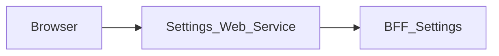

# Settings_Web_Service — Documentation technique

[Présentation du module](module.md) · [English](../en/technical.md) · [README](../../README.md)

## Architecture et traitement des requêtes

Application Next.js 15.5.25, React 19 et TypeScript avec App Router. Le navigateur appelle les routes de la même origine; le serveur Next.js relaie les données vers **BFF_Settings**.



La page conserve le profil éditable et les données du bootstrap dans l’état React. `save` transmet `/settings/profile`, puis remplace le formulaire avec la réponse sauvegardée. Les autres onglets affichent leur état disponible ou indisponible sans simuler de sauvegarde.

Le proxy générique lit le contrat OpenAPI versionné pour autoriser chemins et méthodes. Il conserve paramètres de requête, corps binaire, statuts et en-têtes utiles, filtre les en-têtes de transport, désactive le cache et n’effectue pas de suivi automatique des redirections. Son délai est de 15 secondes.

## Données et persistance

Les sources et limites suivantes concernent le BFF associé, dont dépend la sauvegarde des données affichées.

Le profil vient de Core `/api/v1/user/me/`; les sessions viennent de `/api/v1/sessions/`. Les champs sont `first_name`, `last_name`, `email` et `phone`. Le schéma des sessions ne conserve que les informations affichables et retire les champs internes. Aucune préférence n’est stockée localement par le BFF.

Notifications, apparence et général restent indisponibles. Système propose uniquement une assistance locale. La sécurité affiche les sessions, sans gérer les autres réglages. Les routes de préférences ont actuellement des schémas de requête/réponse vides et le bootstrap ne fournit aucune préférence : leur présence ne constitue pas à elle seule un contrat utilisable.

### Assistance locale (MAIR-304)

`src/components/settings-assistance.tsx` déclenche les exports dans les gestionnaires d’interaction, sans effet, boucle de timers, appel réseau ou persistance. `src/lib/local-assistance.ts` valide le texte saisi (non vide, au plus 5 000 caractères), construit les fichiers texte/JSON et demande un téléchargement Blob. Le lien temporairement ajouté est supprimé immédiatement ; son URL d’objet est révoquée après une seconde en cas de succès ou immédiatement en cas d’échec. L’interface confirme la demande de téléchargement, pas la sauvegarde du fichier ni l’envoi d’un message de support. Les erreurs brutes ne sont jamais affichées ni exportées.

Seules les familles du navigateur et du système sont déduites de `navigator.userAgent` au clic sur le diagnostic. La chaîne brute n’est jamais exportée ; une famille inconnue reste non identifiée. Les seuls champs JSON sont `module`, `generatedAt`, `browser`, `operatingSystem`, `capabilities.objectUrls`. Aucun DTO métier n’est transmis au composant, aucun stockage n’est lu/effacé et aucune version/date de déploiement ni quota n’est inventé. Aucune nouvelle variable, dépendance, route, permission ou opération BFF.

Les tests Node couvrent validation/contenu/confidentialité des exports et nettoyage du téléchargement ; les tests de composants exercent la vraie page, le clavier, axe, les erreurs/reprises et l’absence de nouvel appel bootstrap. Le harness de contrat vérifie également que Système n’ajoute aucune opération amont.

L’état React gère l’affichage et les opérations en cours. Ce dépôt ne définit pas de base métier propre; les garanties de sauvegarde sont celles du BFF et de ses sources décrites ci-dessus.

## Installation et lancement local

Utiliser Node.js 22 pour reproduire le job de contrats et npm avec le fichier de verrouillage versionné. Les versions des autres jobs et de Docker sont précisées plus bas.

Les dépendances privées `@mairie360/*` nécessitent un accès GitHub Packages. Configurer `NODE_AUTH_TOKEN` dans l’environnement avec un jeton autorisé à lire ces packages, conformément à `.npmrc`. Ne pas enregistrer la valeur dans Git.

```bash
npm ci
```

Créer `.env.local` à la racine. Exemple pour le BFF exécuté sur la même machine:

```dotenv
SETTINGS_BFF_URL=http://localhost:4008
```

Démarrer BFF_Settings, seul BFF appelé par ce front, puis lancer le web service. Le port `5008` ci-dessous est un choix local explicite pour éviter les collisions; ce n’est pas une affirmation sur les ports de tous les fichiers Compose.

```bash
npm run dev -- --port 5008
```

Ouvrir `http://localhost:5008`. Pour exécuter le build avec le script Next.js:

```bash
npm run build
npm run start -- --port 5008
```

## Configuration

Les valeurs ci-dessous sont des exemples locaux ou des comportements explicitement indiqués, pas des identifiants de production.

| Variable ou priorité | Exemple local explicite | Rôle |
| --- | --- | --- |
| `SETTINGS_BFF_URL` → `BFF_SETTINGS_BASE_URL` | http://localhost:4008 | Priorité de gauche à droite dans le proxy ; configurer explicitement une URL HTTP(S). Une configuration absente ou invalide renvoie un 503 non mis en cache, sans appel réseau. |

Dans un conteneur, `localhost` désigne le conteneur lui-même. Utiliser le nom DNS du service BFF sur le réseau Docker, ou une adresse d’hôte accessible. Les fichiers Compose incluent parfois d’autres services et des paramètres hérités; vérifier les URL et ports effectifs avant de les employer.

## Routes et contrat de données

Inventaire extrait de `contracts/openapi.json`. Les paramètres entre accolades sont remplacés par des identifiants réels. Les types détaillés, champs requis, réponses et exemples éventuels sont définis dans ce contrat; les statuts du tableau sont ceux déclarés, sans prétendre lister toutes les erreurs de transport ou de validation.

Ces chemins de données sont exposés à la même origine par le proxy; les pages Next.js sont distinctes. `/openapi.json` et `/swagger.json` sont également relayés. L’interface Swagger `/docs` se consulte directement sur le BFF.

| Méthode | Chemin | Corps déclaré | Statuts déclarés |
| --- | --- | --- | --- |
| GET | `/health` | — | 200 |
| GET | `/check_apis` | — | 200, 502 |
| GET | `/settings/bootstrap` | — | 200, 401, 502 |
| PATCH | `/settings/profile` | application/json | 200, 400 |
| PATCH | `/settings/notifications` | application/json | 200, 404 |
| PATCH | `/settings/appearance` | application/json | 200, 404 |
| PATCH | `/settings/general` | application/json | 200, 404 |

### Pages

| Page | Source |
| --- | --- |
| `/` | [src/app/page.tsx](../../src/app/page.tsx) |

Le front n’a aucune route API locale : sa seule route serveur est le proxy contractuel ([src/app/[...path]/route.ts](../../src/app/%5B...path%5D/route.ts)). Un front n’appelle qu’un seul BFF : les chemins de session comme `/api/user/me` ou `/api/auth/*` ne sont pas servis ici (404).

## Session, permissions et erreurs

La session provient uniquement du cookie `accessToken` posé par Login_Web_Service. Le proxy générique utilise le Bearer explicite ou, en son absence, le cookie `accessToken`. Les permissions métier restent celles du BFF et de ses sources.

Le proxy générique répond 400 pour un chemin invalide, 404 pour un chemin hors contrat, 405 pour une méthode interdite et 502 si le service est injoignable ou dépasse le délai. Les réponses amont sont conservées, y compris les corps vides 204/205/304.

Toutes les réponses portent `X-Frame-Options: DENY`, `X-Content-Type-Options: nosniff`, `Referrer-Policy`, `Permissions-Policy` et `Cross-Origin-Resource-Policy`, `Cross-Origin-Embedder-Policy` et `Cross-Origin-Opener-Policy` (`next.config.ts`), et `X-Powered-By` est désactivé. [src/middleware.ts](../../src/middleware.ts) ajoute sur chaque page une `Content-Security-Policy` avec un nonce propre à chaque requête (il ne redirige pas les utilisateurs non authentifiés), que Next.js applique à ses scripts. Les pages sont donc rendues à la demande (`dynamic = "force-dynamic"` dans le layout). Les feuilles de style sont limitées à l'origine et au nonce ; seuls les attributs `style` rendus par les composants partagés passent par `style-src-attr 'unsafe-inline'`, et `next dev` autorise aussi `'unsafe-eval'`. Toute nouvelle ressource externe (image, police, API appelée depuis le navigateur) doit être ajoutée à la politique dans `src/lib/content-security-policy.ts`.

## Synchronisation et vérifications

Le front utilise un seul contrat : celui que **BFF_Settings publie** dans le paquet `@mairie360/bff-settings-openapi`, épinglé à une version exacte `X.Y.Z` dans `package.json`. Il n’est jamais copié depuis un checkout du BFF, qui peut être en avance sur la dernière version publiée. Après une nouvelle version de BFF_Settings, exécuter dans ce dépôt:

```bash
npm install --save-exact @mairie360/bff-settings-openapi@X.Y.Z
npm run contracts:sync
npm run contracts:check
npm run test:contracts
npm run lint
npm run build
```

Le paquet ne contient que la sortie orval (modèles et endpoints TypeScript). `contracts:sync` (alias `contracts:generate`) reconstruit `contracts/openapi.json` depuis le paquet installé avec `scripts/orval-contract.mjs` ; le proxy lit ce fichier et le code importe ses types depuis `@mairie360/bff-settings-openapi/model`. `contracts:check` échoue si la version n’est pas exacte, si le paquet installé diffère de `package.json`, si un second paquet `bff-*-openapi` existe ou si `contracts/openapi.json` n’est plus à jour. Ces commandes fonctionnent hors ligne. Après une montée de version, aligner aussi le tag d’image `bff-settings` des stacks de test. `test:contracts` exécute les tests Node sans couverture ; `npm test` les exécute avec un seuil de 60 % (lignes, branches, fonctions) sur tous les modules `src/**/*.ts`.

Les tests vérifient que le front n’accède au réseau qu’à travers les contrats. `tests/network-contract.test.cjs` analyse l’AST TypeScript de `src/` : seuls `src/lib/bff-client.ts` et `src/lib/bff-proxy.ts` appellent `fetch`, chaque appel `requestBff` (tous dans `src/lib/settings-api.ts`) vise une opération littérale de `contracts/openapi.json`, et le seul relais serveur est le proxy vers `configuredBffUrl()` (la seule URL de BFF lue dans l’environnement est `SETTINGS_BFF_URL` → `BFF_SETTINGS_BASE_URL`) : le front n’appelle qu’un seul BFF. `tests/settings.bff-mocks.test.cjs` exécute toute la chaîne (code navigateur → routes Next.js → vrai client HTTP) contre un vrai serveur HTTP qui simule BFF_Settings à partir de `contracts/openapi.json`. Le mock refuse toute route, méthode ou corps hors contrat, et le harnais refuse tout appel navigateur vers une autre origine et tout appel serveur vers un autre hôte que BFF_Settings. `tests/package-contract.test.cjs` vérifie l’épinglage exact, l’absence de tout autre paquet de contrat, que `contracts/openapi.json` est exactement la reconstruction du paquet et que les stacks de test démarrent `bff-settings` à la version du paquet. orval ne type que les réponses de succès (et les 404 des préférences) : les réponses d’erreur simulées sont marquées hors contrat.

Pour une modification uniquement documentaire, vérifier les liens, l’exactitude des deux langues et `git diff --check`; ne pas régénérer les contrats sans montée de version du paquet.

## CI/CD et exécution Docker

Le job `contracts.yml` utilise Node.js 22, `actions/checkout@v7` et `actions/setup-node@v7`. Il s’exécute sur push, pull request et lancement manuel; il installe avec `npm ci`, contrôle les contrats et lance les tests dédiés.

`cicd.yml` appelle `mairie360/CICD/.github/workflows/frontend-cicd.yml@v2.0.0`, avec `cicd_version: v2.0.0` et `node_version: "23"`. Les étapes réutilisables et les environnements GitHub déterminent les contrôles, publications et déploiements effectifs.

Le Dockerfile utilise par défaut `NODE_VERSION=23.1.0` et le build Next.js `standalone`; la commande de l’image est `["node", "server.js"]`. Le port de l’image et les mappings Compose peuvent différer du port local proposé plus haut.

Avant un lancement Docker, vérifier les variables de service, les secrets de build et les réseaux dans les fichiers du dépôt. Une CI verte valide ses jobs; elle ne prouve pas la disponibilité des services métier dans un environnement distant.

## Diagnostic

Diagnostic du BFF associé: Si le profil charge mais pas les sessions, vérifier `sources.sessions` et la réponse Core `/api/v1/sessions/`. Un PATCH 400 peut venir d’un champ inconnu ou d’un corps vide. Un panneau indisponible ne doit pas être interprété comme une sauvegarde échouée.

En cas d’erreur de proxy, comparer la route et la méthode à l’inventaire, vérifier l’URL du BFF puis la session. Pour un 401 après navigation entre modules, vérifier le cookie `accessToken` et son domaine. Un 404 sur un besoin décrit dans `BACKEND.md` peut correspondre à une fonctionnalité seulement proposée.

## Repères dans le dépôt

- [src/app/page.tsx](../../src/app/page.tsx)
- [src/lib/bff-client.ts](../../src/lib/bff-client.ts)
- [src/lib/bff-proxy.ts](../../src/lib/bff-proxy.ts)
- [src/app/[...path]/route.ts](../../src/app/%5B...path%5D/route.ts)
- [src/lib/settings-api.ts](../../src/lib/settings-api.ts)
- [contracts/openapi.json](../../contracts/openapi.json)
- [scripts/orval-contract.mjs](../../scripts/orval-contract.mjs)
- [scripts/contracts.mjs](../../scripts/contracts.mjs)
- [package.json](../../package.json)
- [.github/workflows/contracts.yml](../../.github/workflows/contracts.yml)
- [.github/workflows/cicd.yml](../../.github/workflows/cicd.yml)
- [Dockerfile](../../Dockerfile)
- [docker-compose.yml](../../docker-compose.yml)

Compléments historiques: [BFF.md](../../BFF.md), [BACKEND.md](../../BACKEND.md). Les besoins proposés doivent rester distincts du comportement effectivement implémenté.
